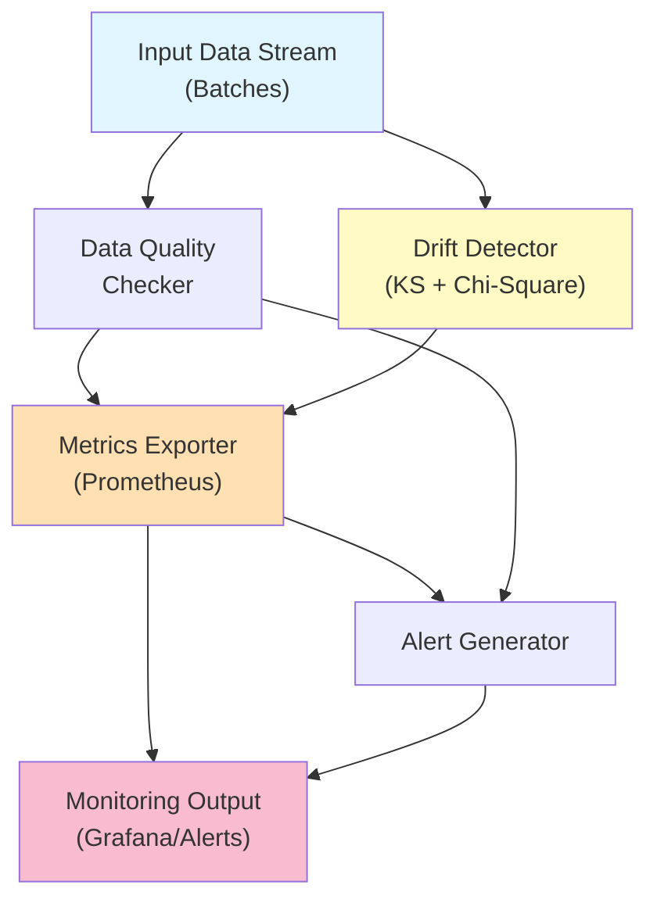

# data-pipeline-monitor

> Lightweight statistical drift detection for production ML pipelines, with native Prometheus integration

[](https://github.com/jrajath94/data-pipeline-monitor/actions)
[](https://codecov.io/gh/jrajath94/data-pipeline-monitor)
[](https://opensource.org/licenses/MIT)
[](https://www.python.org/downloads/)

## The Problem

I spent three months debugging a recommendation model that had decayed from 0.78 AUC to 0.61. Nobody noticed because the monitoring dashboard was missing. We had logs. We had metrics. But nothing tracked what actually matters: _is the data the same distribution we trained on?_

Data drift breaks models in production. Your model expects feature X to have mean 10 and stdev 2. Production sends mean 15 and stdev 3. Nobody's being negligent -- the business shifted, user behavior changed, the real world kept moving. Detecting this requires statistics, not just thresholds. A feature spiking 20% could be normal variance or a genuine distribution shift. The Kolmogorov-Smirnov test quantifies this: is this new batch consistent with what we've seen before? The Chi-square test handles categorical features the same way.

Existing solutions felt like overkill. [Evidently AI](https://www.evidentlyai.com) and [WhyLabs](https://github.com/whylabs/whylogs) work, but they require infrastructure decisions and significant setup. Prometheus is a scraping system, not a statistical engine. I built something small enough to understand, powerful enough to catch real drift before it kills your models, and designed to slot directly into the Prometheus/Grafana stack most teams already run.

The catch: you can't run statistical tests on 100 features manually. And you can't wait until your model's performance tanks to know something's wrong. The monitor needs to catch drift _before_ it propagates.

## What This Project Does

A single-file drift detection library that runs KS tests on numeric features and Chi-square tests on categoricals, classifies results by severity, and pushes everything to Prometheus. Latency is negligible compared to model inference.

- **Statistical drift detection** using two-sample KS test (numeric) and Chi-square goodness-of-fit (categorical)
- **Severity classification** mapping raw p-values to actionable levels (critical/high/medium/low/none)
- **Data quality monitoring** for missing values, duplicates, null features, and high correlations
- **Native Prometheus export** via push gateway pattern for short-lived batch jobs
- **Async monitoring loop** for continuous integration with FastAPI/asyncio applications
- **Tiered alerting** support -- rank features by model importance, set tighter thresholds on the ones that matter

## Architecture



The system tracks four layers: input distribution for each feature, feature correlation shifts, model prediction distribution, and target distribution (when available). Each layer serves a distinct purpose. Input distribution drift is the earliest warning sign -- if the data feeding your model changes shape, your model's assumptions break before predictions degrade. Correlation shifts catch subtler problems: two features that were historically correlated suddenly decorrelate, meaning learned feature interactions no longer hold.

The detector runs checks on every batch that flows through the pipeline. Each check is independent and stateless: compare the current batch against a stored reference distribution. If any check exceeds its threshold, emit an alert. The reference distribution gets updated periodically (weekly or monthly, depending on how fast your domain moves).

## Quick Start

```bash
git clone https://github.com/jrajath94/data-pipeline-monitor.git
cd data-pipeline-monitor
make install && make run
```

```python
import pandas as pd
import numpy as np
from data_pipeline_monitor import MonitoringConfig, PipelineMonitor

# Set up monitoring
config = MonitoringConfig(
    pipeline_name="customer_risk_model",
    drift_threshold=0.05,
    min_baseline_samples=100,
)
monitor = PipelineMonitor(config)

# Establish baseline from training data
baseline = pd.DataFrame({
    "customer_value": np.random.normal(100, 15, 500),
    "transaction_count": np.random.normal(50, 10, 500),
})
monitor.set_baseline(baseline)

# Check a new production batch
current_batch = pd.DataFrame({
    "customer_value": np.random.normal(130, 25, 200),  # Shifted!
    "transaction_count": np.random.normal(50, 10, 200),
})

drift_results = monitor.detect_feature_drift(current_batch)
alerts = monitor.get_alerts(clear=True)
for alert in alerts:
    print(f"{alert.severity.value}: {alert.message}")
# WARNING: Drift detected in feature 'customer_value' (p-value: 0.0001)
```

## Comparison

| Aspect                          | This Project          | Evidently AI  | WhyLabs / whylogs | NannyML       |
| ------------------------------- | --------------------- | ------------- | ----------------- | ------------- |
| Setup complexity                | pip install scipy     | Low-medium    | Medium (SaaS)     | Low-medium    |
| Prometheus integration          | Native (push gateway) | Custom export | Custom export     | Custom export |

## Design Decisions

| Decision                        | Rationale                                                                                 | Alternative Considered                                        | Tradeoff                                                                 |
| ------------------------------- | ----------------------------------------------------------------------------------------- | ------------------------------------------------------------- | ------------------------------------------------------------------------ |
| KS test for numeric drift       | Distribution-free, sensitive to shape and location changes, no distributional assumptions | Earth Mover's Distance, Population Stability Index            | KS is sensitive to sample size; batch sizes of 100-1000 work best        |
| Chi-square for categoricals     | Standard test with interpretable p-values, efficient for low-cardinality features         | Jensen-Shannon divergence (more stable for sparse categories) | Breaks on high-cardinality features (10K+ categories); use JSD for those |
| Proportional baseline scaling   | Handles different batch sizes without frequency inflation                                 | Fixed binning                                                 | Loses some distributional information but avoids false positives         |
| Severity bins (p-value mapping) | Maps raw statistics to actionable alert levels that ops teams understand                  | Single threshold                                              | Requires per-domain tuning, but defaults work for most cases             |
| Prometheus push gateway         | Batch prediction jobs are short-lived processes; push pattern fits naturally              | Pull-based Prometheus, custom API                             | Requires running a push gateway container, but most teams have this      |
| Async monitoring loop           | Non-blocking, integrates directly with FastAPI/asyncio applications                       | Threaded approach                                             | GIL contention under CPU-bound workloads; async is cleaner               |

## How It Works

The core is the `DriftDetector` class that handles both numeric and categorical features. Numeric features use the two-sample Kolmogorov-Smirnov test from scipy. Categorical features use the Chi-square goodness-of-fit test. Both return a p-value and a drift result object with severity classification.

For numeric drift, the KS test compares empirical CDFs of the reference and current distributions. It's distribution-free -- no assumptions about normality. The test statistic is the maximum vertical distance between the two CDFs. A p-value below 0.001 is critical (almost certainly real drift). Below 0.01 is high. Below 0.05 is medium. Below 0.10 is low. Above 0.10 is noise.

For categorical drift, the detector aligns frequency vectors across both distributions (handling categories that appear in only one), normalizes the reference to match the current sample size, and runs the Chi-square test. The 0.5 floor on expected counts prevents the test from becoming undefined on rare categories.

The `PipelineMonitor` wraps the detector with data quality checks, alert generation, and Prometheus metric export. The monitoring loop can run continuously (async) or be called per-batch in a prediction pipeline. Each check adds ~1.2ms for a 5-feature batch -- negligible compared to model inference time.

**Edge cases the system handles:** Multi-modal distributions (KS becomes unreliable -- segment your data first). High-cardinality categoricals (switch to Jensen-Shannon divergence). Seasonal patterns (maintain separate reference windows for weekday/weekend/holiday). Gradual drift (complement KS with exponential moving average tracking to catch slow leaks that accumulate below the detection threshold).

## Testing

```bash
make test    # Run unit and integration tests
make bench   # Performance benchmarks
make lint    # Ruff + mypy
```

## Project Structure

```
data-pipeline-monitor/
  src/data_pipeline_monitor/
    drift.py          # KS test, chi-square test, multivariate drift detection
    monitor.py        # PipelineMonitor orchestrating drift + quality + alerts
    models.py         # DriftResult, MonitoringConfig, AlertSeverity dataclasses
    metrics.py        # Prometheus metric export via push gateway
    exceptions.py     # InsufficientDataError, DriftDetectionError, etc.
  tests/
    test_core.py      # Unit tests for drift detection logic
    test_models.py    # Data model validation tests
  benchmarks/
    bench_core.py     # Performance benchmarks
  examples/
    quickstart.py     # End-to-end usage example
```

## What I'd Improve

- **Tiered alerting by feature importance.** Rank features by SHAP values or permutation importance. Top 10 get tight thresholds (p < 0.01, alert after 15 minutes). Features below 50 get loose thresholds (p < 0.001, alert after 60 minutes). This cuts alert volume by 80% while maintaining coverage on features that actually matter.
- **Gradual drift detection.** The KS test catches sudden distribution shifts but misses slow leaks. Adding exponential smoothing on running mean/stdev with cumulative deviation alerts would catch features that drift 0.1% per batch over months.
- **Grafana dashboard templates.** Ship pre-built dashboard JSON for the three critical panels: heatmap of drift intensity across features and time, time-series of aggregated drift score, and a table of currently drifting features with severity.

## License

MIT -- Rajath John
