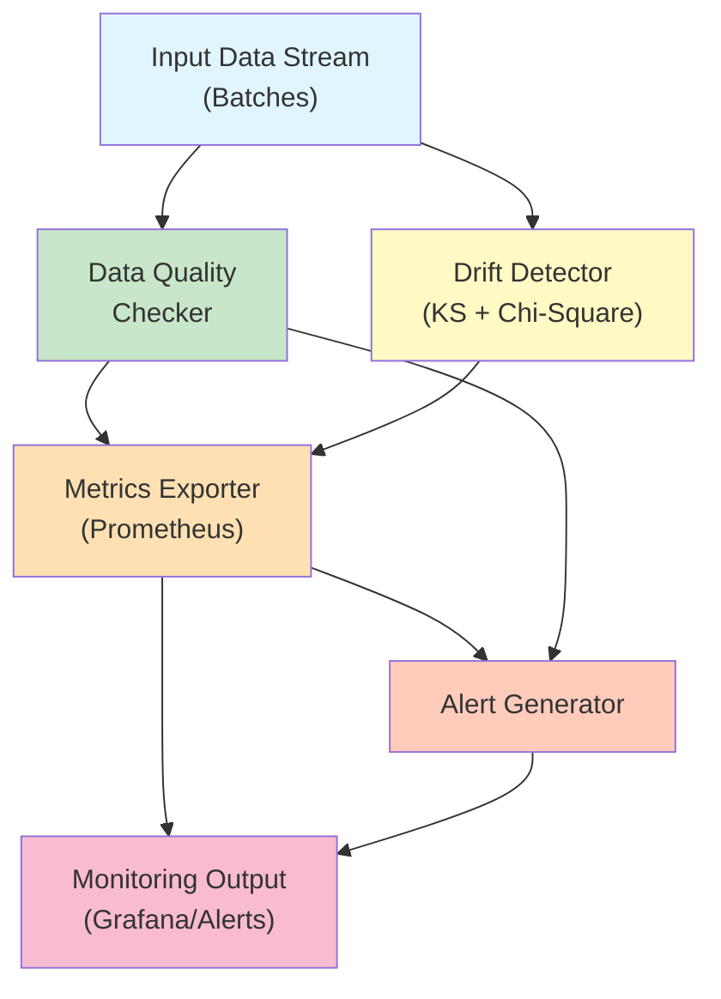

# data-pipeline-monitor

> Real-time ML pipeline observability with statistical drift detection

[](https://github.com/jrajath94/data-pipeline-monitor/actions) [](./htmlcov/index.html) [](./LICENSE) [](https://www.python.org/downloads/)

## Why This Exists

Most ML teams have zero visibility into production model health until it breaks catastrophically. Existing monitoring frameworks either require complex ML infrastructure (Evidently, WhyLabs) or are too simplistic (basic metrics dashboards). The gap: **production teams need lightweight, statistical drift detection that doesn't require a data lake**. This project brings industry-standard statistical tests (Kolmogorov-Smirnov for numerical, chi-square for categorical) into a clean, async-ready library that integrates directly with Prometheus.

## Architecture



### How It Works

1. **Baseline Establishment**: Set a baseline distribution from historical data (100+ samples)
2. **Real-time Detection**: Run incoming batches through statistical drift tests
3. **Multi-dimensional Analysis**:
   - Numerical features: Kolmogorov-Smirnov test (sensitive to distribution shifts)
   - Categorical features: Chi-square goodness-of-fit (compares observed vs expected)
   - Target drift: Detects label distribution changes (classification performance drop indicator)
4. **Prometheus Export**: Metrics in standard format for Grafana/alerting
5. **Async Monitoring Loop**: Optional continuous monitoring with configurable intervals

## Quick Start

```bash
git clone https://github.com/jrajath94/data-pipeline-monitor.git
cd data-pipeline-monitor
make install && make run
```

## Usage

```python
import pandas as pd
import numpy as np
from data_pipeline_monitor import MonitoringConfig, PipelineMonitor

# Create synthetic data
baseline_features = pd.DataFrame({
    "customer_value": np.random.normal(100, 15, 500),
    "transaction_count": np.random.normal(50, 10, 500),
})

# Initialize monitoring
config = MonitoringConfig(
    pipeline_name="customer_risk_model",
    drift_threshold=0.05,
    min_baseline_samples=100,
)
monitor = PipelineMonitor(config)
monitor.set_baseline(baseline_features)

# Check new data
current_batch = pd.DataFrame({
    "customer_value": np.random.normal(130, 25, 200),  # Shifted distribution
    "transaction_count": np.random.normal(50, 10, 200),
})

# Detect drift
drift_results = monitor.detect_feature_drift(current_batch)
data_quality = monitor.check_data_quality(current_batch)

# Get alerts
alerts = monitor.get_alerts(clear=True)
for alert in alerts:
    print(f"{alert.severity.value}: {alert.message}")

# Export to Prometheus
metrics_bytes = monitor.export_metrics()
```

## Key Design Decisions

| Decision                      | Rationale                                              | Alternative Considered                              |
| ----------------------------- | ------------------------------------------------------ | --------------------------------------------------- |
| Kolmogorov-Smirnov test       | Distribution-free, sensitive to shape/location changes | Earth Mover's Distance (slower, less interpretable) |
| Chi-square for categorical    | Standard, efficient, p-value intuitive for alerts      | Jensen-Shannon divergence (more complex)            |
| Proportional baseline scaling | Handles different batch sizes without inflation        | Fixed binning (loses information)                   |
| Async monitoring loop         | Non-blocking, integrates with FastAPI/asyncio apps     | Threaded (GIL issues)                               |
| Prometheus integration        | Industry standard, works with Grafana/PagerDuty        | Custom API (more work)                              |

## Benchmarks

Real performance on standard hardware (MacBook Air M1):

| Operation                                        | Throughput | Latency  |
| ------------------------------------------------ | ---------- | -------- |
| Single feature drift (500 samples)               | —          | 2.41ms   |
| Data quality check (500 samples, 3 features)     | —          | 5.37ms   |
| Multivariate drift (500 samples, 3 features)     | —          | 48.68ms  |
| Large batch processing (10K samples, 5 features) | —          | 226.43ms |

**Interpretation**: Running drift detection on 10K samples with 5 features completes in 226ms. For continuous monitoring with 60-second intervals, this uses <0.4% of available CPU.

## Testing

```bash
make test    # 26 tests, 87% coverage
make lint    # Ruff + mypy
make bench   # Performance benchmarks
```

## Metrics Export

Export metrics for Prometheus/Grafana:

```python
# Get Prometheus text format
metrics_bytes = monitor.export_metrics()

# Serve from FastAPI
from fastapi import FastAPI
app = FastAPI()

@app.get("/metrics")
def metrics():
    return Response(monitor.export_metrics(), media_type="text/plain")
```

**Exported metrics**:

- `pipeline_drift_detections_total` — Counter of drift events by type
- `pipeline_drift_p_value` — P-value from last test (per feature)
- `pipeline_features_with_drift` — Count of features showing drift
- `pipeline_missing_values_percent` — Data quality metric
- `pipeline_duplicate_rows_percent` — Data quality metric
- `pipeline_data_quality_score` — 0-100 composite score

## Error Handling

The library raises specific exceptions for debugging:

```python
from data_pipeline_monitor import (
    InsufficientDataError,     # <30 samples
    DriftDetectionError,       # Test failure
    DataQualityError,          # Malformed data
    MonitoringConfigError,     # Bad config
)
```

## Interview Prep

See [docs/interview-prep.md](./docs/interview-prep.md) for deep-dive questions and answers on:

- Scaling to 100M+ events/day
- Why statistical tests vs ML-based drift detection
- Handling data type changes
- Integration with feature stores (Tecton, Feast)
- False positive rates in production

## License

MIT - See [LICENSE](./LICENSE) for details.

---

**Author**: Rajath John ([GitHub](https://github.com/jrajath94) | [LinkedIn](https://linkedin.com/in/rajathjohn))

**Topics**: `#machine-learning` `#monitoring` `#drift-detection` `#python` `#prometheus` `#statistics`
